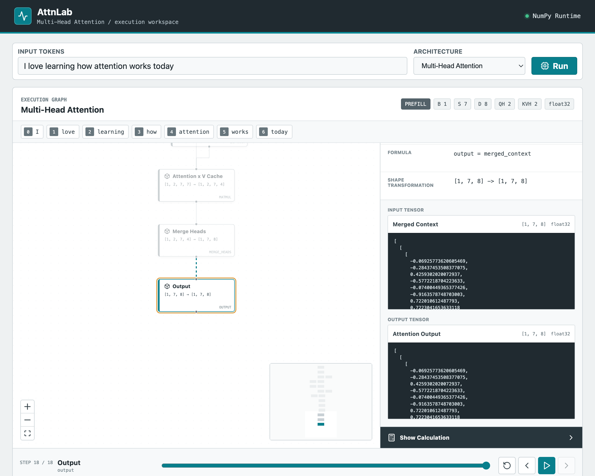
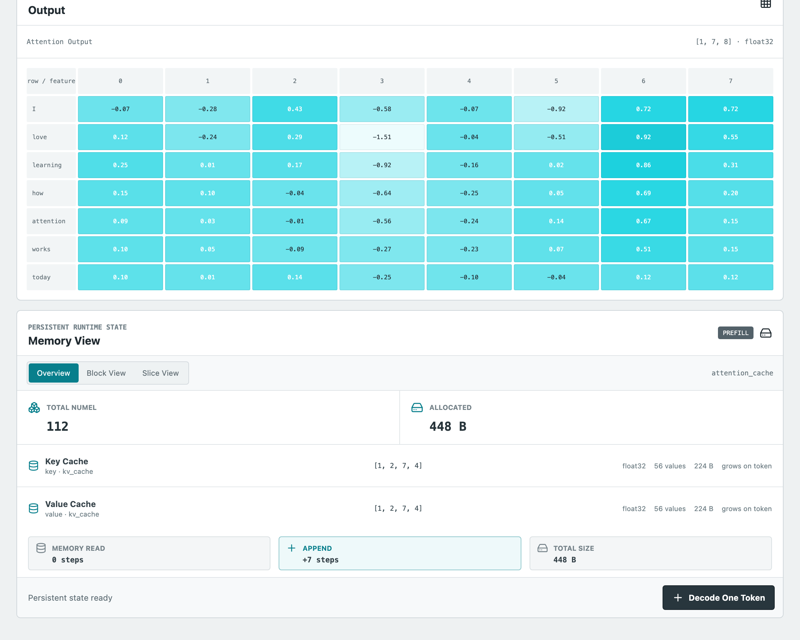
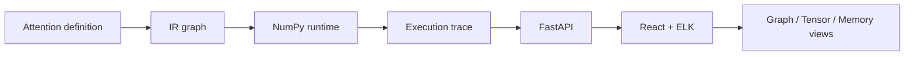

# AttnLab

<p align="center">
  <strong>See attention execute, one tensor operation at a time.</strong>
</p>

<p align="center">
  <a href="https://github.com/long6669/Attention_lab/actions/workflows/ci.yml"></a>
  <a href="LICENSE"></a>
  
  
</p>

AttnLab is an interactive execution microscope for attention mechanisms. It
turns NumPy computations into a graph, execution trace, tensor calculation
inspector, attention matrix, and persistent memory view.

It is designed for learning and architecture analysis: enter a short token
sequence, choose an attention family, and inspect exactly what changes during
prefill and one-token decode.



## Why AttnLab

- **Execution, not static diagrams**: every graph node corresponds to a real
  NumPy operation and recorded tensor.
- **Prefill and decode are separate paths**: decode computes only new-token
  projections and reads persistent runtime state.
- **Inspect the arithmetic**: explore linear projections, dot products,
  softmax stages, RoPE pairs, cache appends, recurrent updates, and routing.
- **Compare memory models**: KV cache, latent cache, and fixed recurrent state
  share a scale-aware `MemorySpec`.
- **Compare architectures side by side**: run 2-4 paths on the same tokens and
  inspect graph size, estimated FLOPs, memory, and per-token cache growth.
- **Share and export experiments**: configuration lives in the URL; graph,
  trace, and PNG exports are available from the workspace.
- **Architecture-neutral pipeline**: IR, runtime, trace, API, layout, and
  visualization remain separate.

## Supported paths

| Path | Persistent memory | Fidelity |
| --- | --- | --- |
| MHA | Per-head K/V cache | Core reference |
| MQA | One shared K/V head | Core reference |
| GQA | Grouped K/V heads | Core reference |
| MHA + RoPE | Rotated K/V cache | Core reference |
| MLA concept | Low-rank latent cache | Educational subset |
| KDA concept | Fixed recurrent state | Educational subset |
| CSA concept | K/V cache plus compressed Top-K routing | Educational subset |
| HCA concept | K/V cache plus multi-resolution routing | Educational subset |

See [algorithm fidelity, equations, omissions, and paper references](docs/ALGORITHMS.md)
before using results in technical comparisons.

## Memory inspection

The Memory View does not assume a fixed KV shape:

- **Overview** reports shape, dtype, element count, bytes, and growth axis.
- **Block View** aggregates long token/head dimensions.
- **Slice View** requests only a bounded head and token range.
- Large tensors are not included in the default API payload.



## Compare and learn

Switch to **Compare** to execute the same input through MHA, MQA, GQA, RoPE,
MLA, KDA, CSA, or HCA. Each result reports metrics derived from its executed
graph:

- Persistent memory and bytes added per token.
- Constant versus linear memory growth.
- Graph nodes and trace steps.
- Shape-based FLOP estimates, clearly labeled as estimates.

The examples gallery opens focused comparisons for MQA cache sharing, MLA
latent compression, KDA fixed state, and CSA Top-K routing. In the workbench,
the architecture lesson follows **Concept → Formula → Execution → Memory**.

Experiment state is encoded in the URL. Use the export toolbar to copy a
shareable link or download Graph JSON, Trace JSON, and a PNG of the current
view.

## Quick start

Requirements:

- Python 3.9 or newer
- Node.js 22 or newer

```bash
git clone https://github.com/long6669/Attention_lab.git
cd Attention_lab
make setup
```

Run these commands in separate terminals:

```bash
make backend
make frontend
```

Open <http://127.0.0.1:5173>.

### Manual setup

```bash
python3 -m venv .venv
.venv/bin/pip install -r backend/requirements.txt
PYTHONPATH=backend .venv/bin/uvicorn app.main:app --reload
```

```bash
cd frontend
npm ci
npm run dev
```

## Deploy

AttnLab ships as one production container: Node builds the frontend, then
FastAPI serves both the API and static application.

```bash
docker build -t attnlab .
docker run --rm -p 8000:8000 attnlab
```

Open <http://127.0.0.1:8000>.

[](https://render.com/deploy?repo=https://github.com/long6669/Attention_lab)

`render.yaml` and `railway.json` are included for managed deployments. Public
instances are educational demos: sessions are in memory and the service is not
designed for untrusted private data.

## How it works



Backend modules own mathematical execution and persistent state. The frontend
only consumes graph, trace, tensor, and `MemorySpec` payloads.

```text
backend/app/
  architectures/   Prefill/decode definitions
  ops/             Traced graph primitives
  runtime/         NumPy operations
  ir/              Graph and tensor specifications
  memory.py        Generic persistent-memory protocol
  api/             Session and slice endpoints

frontend/src/
  components/      Graph, inspector, matrix, timeline, memory UI
  graph/           IR adapter and ELK layout
  api/             Typed API client
```

## Quality checks

```bash
make lint
make test
```

The CI workflow tests Python 3.9 and 3.12, checks Python and TypeScript style,
builds the frontend, and verifies the production Docker image.

## Project scope

AttnLab uses deterministic toy dimensions and synthetic weights. It is not:

- A training framework.
- A CUDA, Triton, or FlashAttention benchmark.
- A drop-in implementation of production model checkpoints.
- Evidence that one attention family has better model quality than another.

The runtime is authoritative about what the UI displays. Concept models are
named and documented as approximations rather than paper-faithful replicas.

## Roadmap

- More reference parity tests.
- Custom attention graphs after the core comparison workflow is stable.

## Contributing

Read [CONTRIBUTING.md](CONTRIBUTING.md) before proposing a new architecture.
Bug reports and focused pull requests are welcome.

## License

Licensed under the [Apache License 2.0](LICENSE).
